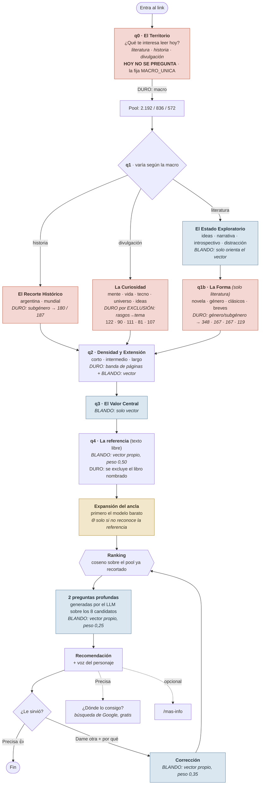

# El pipeline de recomendación de Funes

> **Este documento se actualiza con cada cambio del pipeline.** Si tocaste
> `app/funes_chat/nucleo.py`, `app/routers/funes_chat.py` o
> `app/funes_chat/precios.py` y cambiaste una pregunta, un filtro, un peso o
> una llamada al LLM, actualizá esto en el mismo commit. Los números de costo
> salen de `bench/medir_costos.py`, que lee las tarifas en vivo de OpenRouter:
> corrélo y pegá los números, no los estimes a ojo.

Última actualización: 2026-09-08 · catálogo de 3.600 libros (literatura 2.192 ·
historia 836 · divulgación 572).

> ### El piloto expone una sola rama
>
> `nucleo.MACRO_UNICA = "literatura"`. Mientras esa constante tenga valor, **q0
> no se pregunta**: la macro la fija el servidor en el validador de `q0`
> (`app/routers/funes_chat.py`), la conversación arranca en la q1 de literatura
> y el pool se corta siempre a esos 2.192 libros. Historia y divulgación siguen
> escritas, probadas (`bench/probar_motor.py` las sigue midiendo enteras) y en
> la base; lo único que no hacen es ofrecerse. Volver a las tres es poner la
> constante en `None`, y no hay ningún otro lugar que deshacer.
>
> Todo lo que sigue describe el árbol completo, que es el que el motor conoce.
> Lo que hoy ve un lector es la rama de literatura, sin su primer nodo.

---

## 1. El árbol de consultas

Cada pregunta hace una de tres cosas, y la diferencia es lo que más importa
entender: un **filtro duro** saca libros del pool antes de que se calcule un solo
coseno, y un **filtro blando** solo inclina el puntaje. El coseno no sabe decir
"esto no": por eso lo que el lector pide de forma inequívoca se recorta, y lo que
es cuestión de grado se pondera.

### Los filtros duros, en el orden en que se aplican

`_filtrar_catalogo()` los aplica de lo **más elegido explícitamente** a lo **más
derivado por nosotros**, que es el mismo orden en el que después se aflojan al
revés:

| # | filtro | de dónde sale | qué recorta |
|---|---|---|---|
| 1 | **macro** | q0 —hoy fijada por `MACRO_UNICA`, no preguntada | Todo lo que no es la macro elegida |
| 2 | **libro de referencia** | q4 | El libro que el lector nombró (por título, nunca por autor) |
| 3 | **tema** | q1 o q1b, según la macro | Subgénero en historia · tema por exclusión en divulgación · forma en literatura |
| 4 | **ya leídos** | "¿Ya leíste X?" | Por título+autor, no por id: otra edición del mismo libro tampoco |
| 5 | **banda de páginas** | q2 | corto ≤260 · intermedio 180-420 · largo ≥300 (bandas solapadas a propósito) |

**La escalera de aflojado.** Si el pool cae por debajo de `_PISO_POOL = 80`, se
suelta un filtro y se registra cuál en `funes_sesiones.filtro_aflojado`. Se
afloja siempre desde abajo: primero páginas, después el filtro por tema. **La
macro nunca se afloja**: es lo único que el lector eligió sin ambigüedad.

Dos reglas que no se negocian, las dos por el mismo motivo —un dato faltante no
puede ser una condena—:

- Un libro **sin `nro_paginas`** nunca se excluye (348 de los 2.192 de
  literatura no lo tienen).
- Un libro **sin `rasgos`** nunca se descarta por tema.

### Los filtros blandos: cómo se reparte el puntaje

Cuatro vectores, cada uno con su peso, en vez de un solo texto concatenado. La
razón es medida: concatenado, **lo corto desaparece**. El ancla eran 9 palabras
sobre 56 y era inerte; las profundas, 3 sobre 48, no cambiaban el ganador en
ninguno de los 24 casos del banco.

| componente | peso | contra qué compara | por qué ese peso |
|---|---:|---|---|
| perfil (q1+q2+q3) | 0,25–1,00 | experiencia | Es lo único que siempre existe; se queda con lo que sobra |
| ancla (q4) | **0,50** | sinopsis | La referencia es contenido, no forma de leer |
| ajuste (2 profundas + leídos) | **0,25** | experiencia | Termina de decidir entre los 8 candidatos |
| corrección (motivo del rechazo) | **0,35** | sinopsis | Es lo último que dijo, escribiendo, y después de ver un libro concreto |

Los pesos fijos suman 1,10, así que cuando están los cuatro se **escalan
proporcionalmente** hasta `_MAX_SIN_PERFIL = 0,75` y el perfil se queda con
0,25. Sin corrección el reparto es idéntico al histórico (0,50 + 0,25).

Cada opción de q1, q2 y q3 tiene además su **`consulta`**: la misma elección
reescrita en idioma de catálogo. Medido: la etiqueta corta de "los seres vivos"
daba coseno 0,443 y traía psicología; la consulta larga da 0,600 y trae bichos y
plantas.

### Lo que está apagado, y por qué

| mecanismo | estado | motivo |
|---|---|---|
| `_CENTRAR` (restar la media de la macro) | **off** | Arregla los hubs (máximo 20→13, asimetría 1,81→1,06) pero baja la calidad: juez 3,21 → 2,96 |
| `_PESO_DIVERSIDAD` (castigar repetir autor) | **0** | Tres libros del mismo autor nos molestan a nosotros, no al juez, que les puso 4 y 5 |
| `_DOS_VECTORES` (sinopsis + experiencia) | **off** | Reemplazar el abstracto empeora: acierto@1 de 4 a 1 |

---

## 2. Los costes

Tarifas en vivo de OpenRouter al 2026-09-05. **La entrada es texto real** (los
prompts que efectivamente se mandan, medidos por `bench/medir_costos.py`); la
salida está estimada a partir del límite de palabras que impone cada prompt.

| modelo | dónde | entrada | salida | extra |
|---|---|---|---|---|
| `google/gemini-2.5-flash` | la voz, las 2 preguntas, el rechazo, el «ya leí», el 1er intento del ancla | $0,30 / M | $2,50 / M | — |
| `openai/gpt-5-mini:online` | **solo el respaldo del ancla** | $0,25 / M | $2,00 / M | **$0,010 por búsqueda** |
| `openai/text-embedding-3-small` | los vectores | $0,02 / M | — | — |

**La tarifa de búsqueda va por proveedor y no acompaña al precio del modelo.**
Google cobra $0,014, OpenAI y Anthropic $0,010, Perplexity $0,005. Por eso el
respaldo del ancla usa un modelo distinto al de la voz: es la única llamada que
paga búsqueda, y ahí la tarifa manda más que el precio por token.

**Y la búsqueda cobra por dos lados.** Medido con la misma pregunta a los dos:
el prompt pasó de **31 a 2.680 tokens**. Los resultados se pegan adelante del
prompt y se pagan como entrada; la respuesta también se alarga porque el modelo
cita fuentes (55 → 289). Por eso `_limpiar_citas` existe: saca los
`[dominio.com](https://...)` antes de que ese texto se embeba.

### Por llamada

| llamada | cuándo | entrada | salida | USD c/u |
|---|---|---:|---:|---:|
| **ancla · el modelo la reconoció** | 1 vez por conversación | 449 | 90 | **$0,00036** |
| **ancla · NO la reconoció** 🌐 | cae a `:online`; incluye los ~2.650 tokens de resultados | 3.099 | 180 | **$0,01113** |
| pregunta profunda | 2 veces | 1.513 | 135 | $0,00079 |
| voz de la recomendación | 1 por recomendación (≤3) | 1.277 | 240 | $0,00098 |
| reformular el rechazo | 1 por «dame otra» (≤2) | 135 | 60 | $0,00019 |
| resumir un libro leído | 1 por «sí, lo leí» | 191 | 45 | $0,00017 |
| info extra (`/mas-info`) | opcional | 439 | 180 | $0,00058 |
| ~~precio de referencia~~ 🌐 | **apagado** desde el 2026-09-06 | 414 | 90 | ~~$0,01435~~ |
| embeddings | ~12 por conversación | 142 | — | $0,0000028 |

### Por conversación y cada 1.000

**No queda ninguna llamada con búsqueda web salvo el respaldo del ancla.** El
precio está apagado y el botón «¿Dónde lo consigo?» va a una búsqueda de Google
(`urlDeBusqueda` en el template), que no le cuesta nada a nadie.

| escenario | USD c/u | cada 1.000 |
|---|---:|---:|
| 1 recomendación, aceptada | $0,0029 | **$2,93** |
| 3 recomendaciones, 2 rechazos | $0,0053 | **$5,28** |
| La conversación real del piloto: 3 «ya leí» + 3 recomendaciones | $0,0058 | **$5,79** |
| La misma, pero el ancla **no** reconoció la referencia | $0,0169 | $16,93 |
| Con `/mas-info` | $0,0059 | $5,87 |
| Abandono en q2 (no llega a q4) | ~$0,000003 | ~$0,003 |

### El precio era el gasto, y no lo pedía nadie

Hasta el 2026-09-06, `/precio` era el **86% del costo de una conversación**:
$0,033 de $0,039. Todo lo demás junto —el ancla, las dos preguntas, las tres
voces, las dos reformulaciones y los doce embeddings— sumaba medio centavo.

Y no era una llamada opcional al final: el template hacía
`promesaPrecio = pedirPrecio(id)` **apenas llegaba cada recomendación**, antes de
que la persona votara, y el precio se *mostraba* solo si votaba «Precisa». O sea
hasta **tres búsquedas web por conversación que el lector nunca pidió**.

| | USD c/u | cada 1.000 |
|---|---:|---:|
| 3 recomendaciones con el prefetch de precio | $0,0387 | $38,66 |
| las mismas, sin él | $0,0053 | $5,28 |

**Apagarlo bajó el costo un 86%.** `precios.py`, el endpoint y la caché quedan
intactos: prender `PRECIO_ENCENDIDO` alcanza para recuperarlo. Si eso pasa, el
arreglo obvio es no adivinar — pedirlo **cuando la persona vota «Precisa»**, no
antes: cuesta una espera y ahorra dos de cada tres llamadas.

### Lo único que queda por optimizar

Con el precio apagado, **el único gasto variable es el respaldo del ancla**.
`_expandir_ancla` pregunta primero al modelo pelado y solo cae a `:online` si el
modelo admite que no reconoce la referencia de q4. Cuando cae, la conversación
pasa de $0,0058 a $0,0169: **casi tres veces más cara**.

**Lo que falta medir, y es lo único que mueve el número ahora:** cada cuántas
conversaciones el modelo no reconoce la referencia. Se guarda en
`funes_recomendaciones.ancla_conocida` justamente para eso, así que sale de una
consulta al panel.

Dos cosas más sobre esa llamada:

1. **La caché la amortiza entre lectores.** `_CACHE_ANCLAS` guarda por texto
   crudo con TTL de una hora, así que dos personas que escriben «Borges» pagan
   una sola expansión.
2. **Sin `:online` el ancla se rompe para lo que el modelo no sabe de memoria.**
   Por eso el fallback existe: es lo que hace que «Cánticos de la lejana Tierra,
   de Arthur C. Clarke» funcione. El camino barato no es «mejor», es el que
   alcanza cuando alcanza.

### Costo total estimado del piloto

Va en rango porque depende de cuántas q4 caen en búsqueda web: el piso asume que
el modelo reconoce siempre, el techo que no reconoce nunca.

| escala | conversaciones | costo |
|---|---:|---:|
| Piloto actual (bitácora: 38 sesiones, 19 recomendaciones) | ~40 | **$0,23 – $0,68** |
| Ronda de amigos | 200 | $1,16 – $3,39 |
| Piloto abierto | 1.000 | **$5,79 – $16,93** |
| Si escala | 10.000 | $58 – $169 |

A esto hay que sumarle, **una sola vez y no por conversación**, la vectorización
del catálogo nuevo — que ya está hecha y pagada del lado de la curaduría.

---

## 3. Cómo mantener esto al día

Cuando cambies el pipeline:

1. Corré `.venv/Scripts/python.exe bench/medir_costos.py` y pegá los números
   nuevos. Lee las tarifas en vivo, así que también sirve para detectar que
   OpenRouter cambió un precio.
2. Actualizá el diagrama si agregaste, sacaste o cambiaste de bando una
   pregunta (blando ↔ duro).
3. Si cambiaste un peso o un filtro, corré `bench/probar_motor.py` (gratis) y
   anotá el número de casos en verde.
4. `bench/simular.py` **se paga con crédito de OpenRouter**: no lo corras sin
   avisarle al usuario, y no lo lances con el código a medio tocar.

### Verificaciones que no cuestan nada

- `bench/probar_motor.py` — asserts sobre filtros, pesos, formas y validadores.
- `bench/probar_motor.py --http` — smoke contra el server local
  (`LIBRERO_LOCAL_URL` para apuntar a otro puerto).
- `bench/medir_costos.py` — tamaños y tarifas, sin pegarle al LLM.
- `bench/probar_ancla.py` — compara prompts del ancla. **Este sí gasta**: 2
  llamadas por caso.
